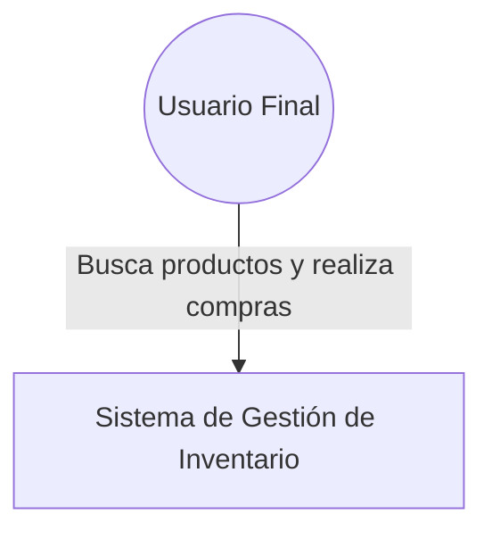
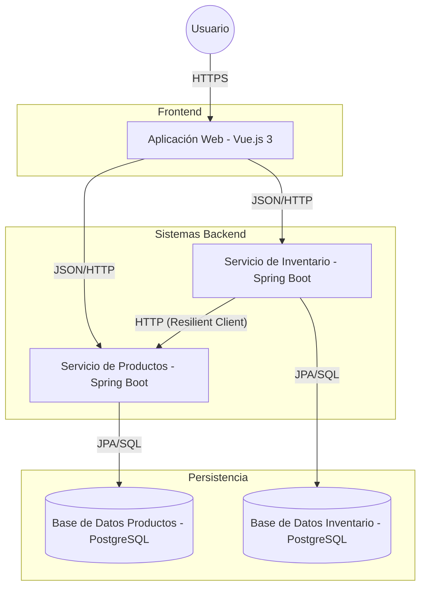

# Documentación de Arquitectura

Este documento describe la arquitectura del sistema de Inventario y Productos de Linktic, siguiendo el modelo C4.

## 1. Diagrama de Contexto (Nivel 1)

Muestra cómo el sistema interactúa con los usuarios y otros sistemas externos.



## 2. Diagrama de Contenedores (Nivel 2)

Muestra los principales contenedores que forman el sistema y el flujo de comunicación.



## 3. Decisiones Arquitectónicas

- **Microservicios:** Separación de dominios para facilitar la escalabilidad y el mantenimiento independiente.
- **Comunicación Resiliente:** El servicio de Inventario utiliza Resilience4j (Circuit Breaker, Retry) para comunicarse con Productos, evitando fallos en cadena.
- **Frontend SPA:** Vue.js 3 con Composition API y Pinia para una gestión de estado reactiva y eficiente.
- **Consistencia:** Uso de bloqueo optimista (`@Version`) en Inventario para manejar concurrencia.
- **Seguridad:** Implementación de interceptores en el frontend para inyectar tokens de autenticación de forma centralizada.

## 4. Tecnologías Clave

| Capa | Tecnología |
| :--- | :--- |
| **Frontend** | Vue 3, Vite, Pinia, Tailwind CSS |
| **Backend** | Java 17, Spring Boot 3, Spring Data JPA |
| **Base de Datos** | PostgreSQL 15 |
| **Pruebas** | Vitest, Playwright, Testcontainers |
| **Observabilidad** | Spring Actuator |
```
